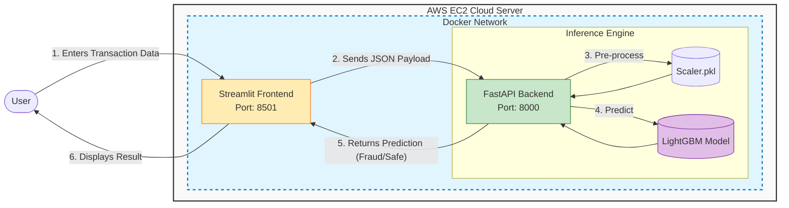

```mermaid
graph LR
    User([User]) -- "1. Enters Transaction Data" --> UI[Streamlit Frontend\nPort: 8501]
    
    subgraph AWS_EC2_Instance [AWS EC2 Cloud Server]
        subgraph Docker_Network [Docker Network]
            UI -- "2. Sends JSON Payload" --> API[FastAPI Backend\nPort: 8000]
            
            subgraph Model_Logic [Inference Engine]
                API -- "3. Pre-process" --> Scaler[(Scaler.pkl)]
                Scaler --> API
                API -- "4. Predict" --> Model[(LightGBM Model)]
                Model --> API
            end
        end
    end

    API -- "5. Returns Prediction (Fraud/Safe)" --> UI
    UI -- "6. Displays Result" --> User

    style AWS_EC2_Instance fill:#f9f9f9,stroke:#333,stroke-width:2px
    style Docker_Network fill:#e1f5fe,stroke:#0277bd,stroke-width:2px,stroke-dasharray: 5 5
    style UI fill:#ffecb3,stroke:#ff6f00
    style API fill:#c8e6c9,stroke:#2e7d32
    style Model fill:#e1bee7,stroke:#7b1fa2
```