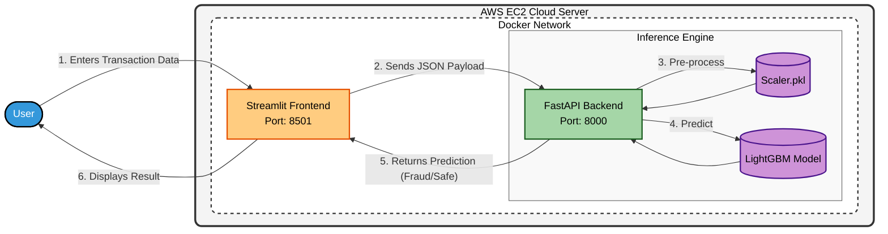

```mermaid
graph LR
    User([User]) -- "1. Enters Transaction Data" --> UI[Streamlit Frontend\nPort: 8501]
    
    subgraph AWS_EC2_Instance [AWS EC2 Cloud Server]
        subgraph Docker_Network [Docker Network]
            UI -- "2. Sends JSON Payload" --> API[FastAPI Backend\nPort: 8000]
            
            subgraph Model_Logic [Inference Engine]
                API -- "3. Pre-process" --> Scaler[(Scaler.pkl)]
                Scaler --> API
                API -- "4. Predict" --> Model[(LightGBM Model)]
                Model --> API
            end
        end
    end

    API -- "5. Returns Prediction (Fraud/Safe)" --> UI
    UI -- "6. Displays Result" --> User

    %% --- High Visibility Styling ---
    
    %% Containers
    style AWS_EC2_Instance fill:#f4f4f4,stroke:#333,stroke-width:3px,color:#000,rx:10,ry:10
    style Docker_Network fill:#fff,stroke:#333,stroke-width:2px,stroke-dasharray: 5 5,color:#000,rx:10,ry:10
    style Model_Logic fill:#f9f9f9,stroke:#666,stroke-width:1px,color:#000
    
    %% Components (Black text for maximum contrast)
    style User fill:#3498db,stroke:#000,stroke-width:2px,color:#fff
    style UI fill:#FFCC80,stroke:#E65100,stroke-width:2px,color:#000
    style API fill:#A5D6A7,stroke:#1B5E20,stroke-width:2px,color:#000
    style Model fill:#CE93D8,stroke:#4A148C,stroke-width:2px,color:#000
    style Scaler fill:#CE93D8,stroke:#4A148C,stroke-width:2px,color:#000
```
