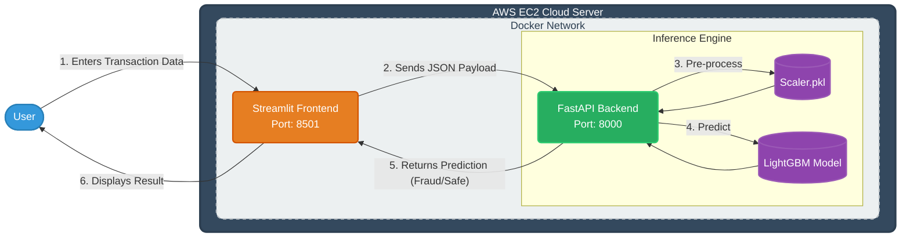

```mermaid
graph LR
    User([User]) -- "1. Enters Transaction Data" --> UI[Streamlit Frontend\nPort: 8501]
    
    subgraph AWS_EC2_Instance [AWS EC2 Cloud Server]
        subgraph Docker_Network [Docker Network]
            UI -- "2. Sends JSON Payload" --> API[FastAPI Backend\nPort: 8000]
            
            subgraph Model_Logic [Inference Engine]
                API -- "3. Pre-process" --> Scaler[(Scaler.pkl)]
                Scaler --> API
                API -- "4. Predict" --> Model[(LightGBM Model)]
                Model --> API
            end
        end
    end

    API -- "5. Returns Prediction (Fraud/Safe)" --> UI
    UI -- "6. Displays Result" --> User

    %% --- Improved Styling Section ---
    %% Darker container for AWS with white text
    style AWS_EC2_Instance fill:#34495e,stroke:#2c3e50,stroke-width:3px,color:#fff,rx:10,ry:10
    %% Lighter subtle container for network
    style Docker_Network fill:#ecf0f1,stroke:#bdc3c7,stroke-width:2px,stroke-dasharray: 5 5,color:#2c3e50,rx:10,ry:10
    
    %% Vibrant, high-contrast component colors with white text
    style User fill:#3498db,stroke:#2980b9,stroke-width:2px,color:#fff
    style UI fill:#e67e22,stroke:#d35400,stroke-width:2px,color:#fff,rx:5,ry:5
    style API fill:#27ae60,stroke:#2ecc71,stroke-width:2px,color:#fff,rx:5,ry:5
    style Model fill:#8e44ad,stroke:#9b59b6,stroke-width:2px,color:#fff,rx:5,ry:5
    style Scaler fill:#8e44ad,stroke:#9b59b6,stroke-width:2px,color:#fff,rx:5,ry:5
```